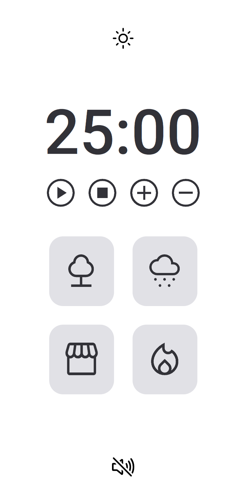
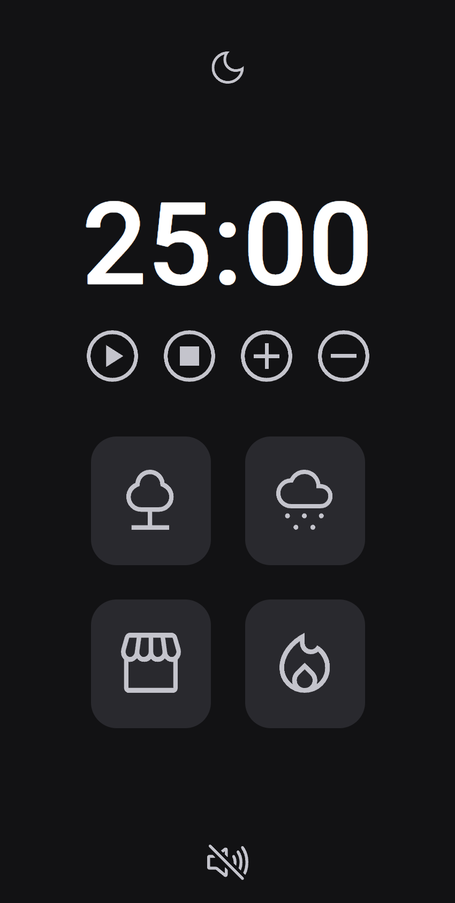

<h1 align="center"> Cronômetro - Pomodoro (Responsivo) </h1>

Projeto criado na aula de manipulação de DOM, promovido pela Rocketseat para ensino de tecnologias WEB.

  <a href="#-tecnologias">Tecnologias</a>&nbsp;&nbsp;&nbsp;|&nbsp;&nbsp;&nbsp;
  <a href="#-projeto">Projeto</a>&nbsp;&nbsp;

 

  
  

## 🚀 Tecnologias

Esse projeto foi desenvolvido com as seguintes tecnologias:

- HTML e CSS
- JavaScript
- Git e Github

 

## 💻 Projeto

O cronômetro tem como intuito trabalhar com o metodo de ensino, Pomodoro. Nesse projeto você consegue escolher acrescentar ou diminuir 5 minutos, e também pode escolher uma faixa de som para escutar enquanto se concentra.

---

Feito com ♥ by Daniel Kyochi 🌍

